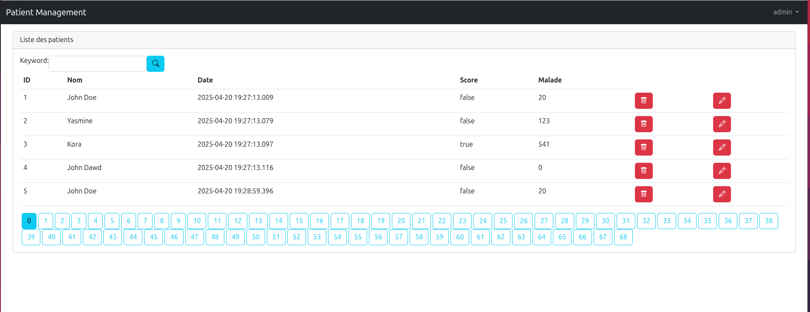
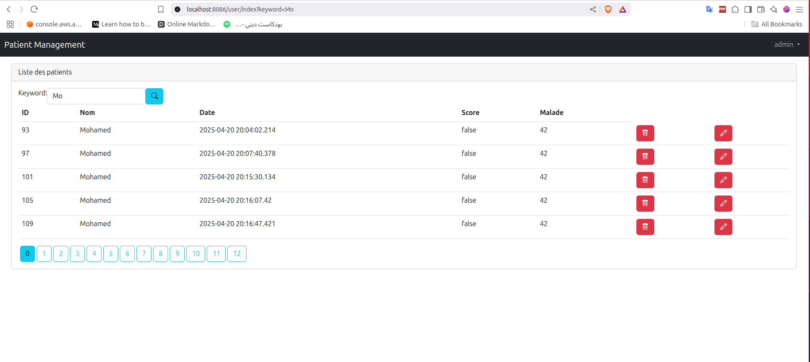
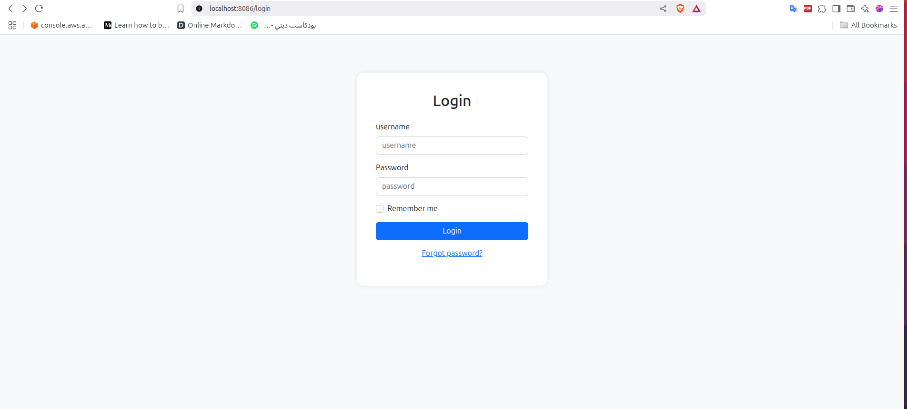

# Activité Pratique N°3 - Application de Gestion des Patients

## Spring MVC, Spring Data JPA, Thymeleaf et Spring Security


---

## Table des Matières

1. [Introduction](#introduction)
2. [Architecture et Technologies](#architecture-et-technologies)
3. [Partie 1 - Application Web de base](#partie-1---application-web-de-base)
4. [Partie 2 - Templates et Validation](#partie-2---templates-et-validation)
5. [Partie 3 - Sécurité avec Spring Security](#partie-3---sécurité-avec-spring-security)
6. [Structure du Projet](#structure-du-projet)
7. [Fonctionnalités Implémentées](#fonctionnalités-implémentées)
8. [Guide d&#39;Installation et d&#39;Exécution](#guide-dinstallation-et-dexécution)
9. [Captures d&#39;Écran](#captures-décran)
10. [Conclusion](#conclusion)

---

## Introduction

Cette application web JEE développée avec Spring Boot permet la gestion complète des patients dans un contexte médical. Elle implémente les meilleures pratiques du développement web moderne avec Spring MVC, Spring Data JPA, Thymeleaf et Spring Security.


**Objectifs du TP :**

- Créer une application web robuste pour la gestion des patients
- Implémenter la pagination et la recherche
- Créer des templates réutilisables avec Thymeleaf
- Mettre en place une sécurité multicouche avec Spring Security
- Valider les formulaires côté serveur

---

## Architecture et Technologies

### Technologies Utilisées

- **Spring Boot 3.4.4** - Framework principal
- **Spring MVC** - Architecture Model-View-Controller
- **Spring Data JPA** - Couche d'accès aux données
- **Spring Security** - Système de sécurité et authentification
- **Thymeleaf** - Moteur de templates
- **MySQL** - Base de données relationnelle
- **Bootstrap 5.2.3** - Framework CSS pour l'interface utilisateur
- **Maven** - Gestionnaire de dépendances

### Architecture MVC

```
┌─────────────────┐    ┌─────────────────┐    ┌─────────────────┐
│     View        │    │   Controller    │    │     Model       │
│   (Thymeleaf)   │◄──►│  (Spring MVC)   │◄──►│ (JPA Entities)  │
└─────────────────┘    └─────────────────┘    └─────────────────┘
         ▲                       │                       │
         │                       ▼                       ▼
┌─────────────────┐    ┌─────────────────┐    ┌─────────────────┐
│   Templates     │    │   Services      │    │  Repositories   │
│    (HTML)       │    │  (Business)     │    │   (Data)        │
└─────────────────┘    └─────────────────┘    └─────────────────┘
```

---

## Partie 1 - Application Web de base

### 1.1 Entité Patient

L'entité `Patient` représente le modèle de données principal :

```java
@Entity
@AllArgsConstructor @NoArgsConstructor @Data
@Builder
public class Patient {
    @Id  
    @GeneratedValue(strategy = GenerationType.IDENTITY)
    private Long id;
    private String nom;
    private Date dateNaissance;
    private boolean malade;
    private int score;
}
```

**Concepts clés :**

- `@Entity` : Marque la classe comme entité JPA
- `@Id @GeneratedValue` : Clé primaire auto-incrémentée
- `@Data` : Génère automatiquement les getters/setters (Lombok)
- `@Builder` : Pattern Builder pour la création d'objets

### 1.2 Repository avec Spring Data JPA

```java
public interface PatientRpository extends JpaRepository<Patient, Long> {
    Page<Patient> findByNomContains(String keyword, Pageable pageable);

    @Query("select p from Patient p where p.nom like :x")
    Page<Patient> findByNom(@Param("x") String x, Pageable pageable);
}
```

**Avantages :**

- Méthodes CRUD automatiques
- Pagination native
- Requêtes dérivées du nom de la méthode
- Support des requêtes JPQL personnalisées

### 1.3 Contrôleur MVC

```java
@Controller
public class PatientController {
    @Autowired
    private PatientRpository patientRepository;
  
    @GetMapping("/user/index")
    public String index(Model model,
                        @RequestParam(name = "page",defaultValue = "0") int page,
                        @RequestParam(name = "size",defaultValue = "5") int size,
                        @RequestParam(name = "keyword",defaultValue = "") String kw) {
        Page<Patient> pagePatients = patientRepository.findByNomContains(kw, PageRequest.of(page,size));
        model.addAttribute("listPatients",pagePatients.getContent());
        model.addAttribute("pages",new int[pagePatients.getTotalPages()]);
        model.addAttribute("currentPage",page);
        model.addAttribute("keyword",kw);
        return "patients";
    }
}
```

**Fonctionnalités implémentées :**

- ✅ Affichage paginé des patients
- ✅ Recherche par nom avec mot-clé
- ✅ Navigation entre les pages
- ✅ Gestion des paramètres d'URL


[Page d'accueil montrant la liste des patients avec pagination et recherche]

---

## Partie 2 - Templates et Validation

### 2.1 Template de Base (Layout)

Le template principal utilise Thymeleaf Layout Dialect :

```html
<!DOCTYPE html>
<html lang="en" xmlns:th="http://www.thymeleaf.org"
      xmlns:layout="http://www.ultraq.net.nz/thymeleaf/layout"
      xmlns:sec="http://www.thymeleaf.org/extras/spring-security">
<head>
    <meta charset="UTF-8">
    <meta name="viewport" content="width=device-width, initial-scale=1">
    <title layout:title-pattern="$CONTENT_TITLE - $LAYOUT_TITLE">Patient Management</title>
    <link rel="stylesheet" href="/webjars/bootstrap/5.2.3/css/bootstrap.min.css">
    <link rel="stylesheet" href="/webjars/bootstrap-icons/1.10.3/font/bootstrap-icons.css">
</head>
<body>
    <nav class="navbar navbar-expand-lg navbar-dark bg-dark">
        <div class="container-fluid">
            <a class="navbar-brand" href="#">Patient Management</a>
            <div class="navbar-nav ms-auto">
                <div class="nav-item dropdown" sec:authorize="isAuthenticated()">
                    <a class="nav-link dropdown-toggle" href="#" role="button" data-bs-toggle="dropdown">
                        <span sec:authentication="name"></span>
                    </a>
                    <ul class="dropdown-menu">
                        <li><a class="dropdown-item" href="/user/index">Patients</a></li>
                        <li sec:authorize="hasRole('ADMIN')"><a class="dropdown-item" href="/formPatient">Add Patient</a></li>
                        <li><hr class="dropdown-divider"></li>
                        <li><a class="dropdown-item" href="/logout">Logout</a></li>
                    </ul>
                </div>
            </div>
        </div>
    </nav>

    <main class="container-fluid">
        <div layout:fragment="content">
            <!-- Page content will be inserted here -->
        </div>
    </main>

    <script src="/webjars/bootstrap/5.2.3/js/bootstrap.bundle.min.js"></script>
</body>
</html>
```

**Concepts clés :**

- `layout:fragment="content"` : Zone de contenu dynamique
- `sec:authorize` : Contrôle d'accès conditionnel
- Integration Bootstrap via WebJars
- Navigation responsive avec menu déroulant

### 2.2 Page de Liste des Patients

```html
<div layout:fragment="content">
    <div class="p-3">
        <div class="card">
            <div class="card-header">Liste des patients</div>
            <div class="card-body">
                <form method="get" th:href="@{/user/index}">
                    <ul class="nav nav-pills">
                        <li><label class="form-label">Keyword:</label></li>
                        <li><input type="text" class="form-control" name="keyword"></li>
                        <li><button class="btn btn-info"><i class="bi bi-search"></i></button></li>
                    </ul>
                </form>
                <table class="table">
                    <thead>
                        <tr><th>ID</th><th>Nom</th><th>Date</th><th>Score</th><th>Malade</th></tr>
                    </thead>
                    <tbody>
                        <tr th:each="p:${listPatients}">
                            <td th:text="${p.id}"></td>
                            <td th:text="${p.nom}"></td>
                            <td th:text="${p.dateNaissance}"></td>
                            <td th:text="${p.malade}"></td>
                            <td th:text="${p.score}"></td>
                            <td th:if="${#authorization.expression('hasRole(''ADMIN'')')}">
                                <a onclick="return confirm('Etes vous sûre?')" class="btn btn-danger"
                                   th:href="@{/admin/deletePatient(id=${p.id}, keyword=${keyword}, page=${currentPage})}">
                                    <i class="bi bi-trash"></i>
                                </a>
                            </td>
                        </tr>
                    </tbody>
                </table>
                <!-- Pagination -->
                <ul class="nav nav-pills">
                    <li th:each="page,status:${pages}">
                        <a th:class="${status.index==currentPage?'btn btn-info ms-1':'btn btn-outline-info ms-1'}"
                           th:href="@{/user/index(page=${status.index}, keyword=${keyword})}"
                           th:text="${status.index}">
                        </a>
                    </li>
                </ul>
            </div>
        </div>
    </div>
</div>
```


[Interface de liste des patients avec tableau, recherche et pagination]

---

## Partie 3 - Sécurité avec Spring Security

### 3.1 Configuration de Sécurité

```java
@Configuration
@EnableWebSecurity
@EnableMethodSecurity(prePostEnabled = true)
public class SecurityConfig {

    @Bean
    public JdbcUserDetailsManager jbdcUserDetailsManager(DataSource dataSource){
        return new JdbcUserDetailsManager(dataSource);
    }

    @Bean
    public SecurityFilterChain securityFilterChain(HttpSecurity httpSecurity) throws Exception {
        httpSecurity
                .formLogin(form -> form
                        .loginPage("/login")
                        .defaultSuccessUrl("/")
                        .permitAll()
                )
                .rememberMe(remember -> remember
                        .key("uniqueAndSecretKey")
                        .tokenValiditySeconds(86400) // 1 day
                )
                .authorizeHttpRequests(auth -> auth
                        .requestMatchers("/webjars/**").permitAll()
                        .anyRequest().authenticated()
                )
                .exceptionHandling(exceptions -> exceptions
                        .accessDeniedPage("/notAuthorized")
                );

        return httpSecurity.build();
    }

    @Bean
    PasswordEncoder passwordEncoder(){
        return new BCryptPasswordEncoder();
    }
}
```

### 3.2 Schema de Base de Données pour l'Authentification

```sql
-- Drop tables if they exist (clean slate)
DROP TABLE IF EXISTS authorities;
DROP TABLE IF EXISTS users;

-- Create users table
CREATE TABLE users(
    username varchar(50) NOT NULL PRIMARY KEY,
    password varchar(500) NOT NULL,
    enabled boolean NOT NULL
);

-- Create authorities table
CREATE TABLE authorities (
    username varchar(50) NOT NULL,
    authority varchar(50) NOT NULL,
    CONSTRAINT fk_authorities_users FOREIGN KEY(username) REFERENCES users(username)
);

-- Create unique index
CREATE UNIQUE INDEX ix_auth_username ON authorities (username,authority);
```

### 3.3 Initialisation des Utilisateurs

```java
@Bean
CommandLineRunner commandLineRunner(JdbcUserDetailsManager jdbcUserDetailsManager, PasswordEncoder passwordEncoder){
    return args -> {
        try {
            UserDetails user1 = jdbcUserDetailsManager.loadUserByUsername("user1");
        } catch (Exception e) {
            jdbcUserDetailsManager.createUser(
                    User.withUsername("user1").password(passwordEncoder.encode("5678")).roles("USER").build()
            );
        }
      
        try {
            UserDetails admin = jdbcUserDetailsManager.loadUserByUsername("admin");
        } catch (Exception e) {
            jdbcUserDetailsManager.createUser(
                    User.withUsername("admin").password(passwordEncoder.encode("56789")).roles("ADMIN").build()
            );
        }
    };
}
```

### 3.4 Types d'Authentification Implémentés

#### 1. JDBC Authentication

- Utilisateurs stockés en base de données
- Mots de passe cryptés avec BCrypt
- Rôles et permissions gérés via la table `authorities`

#### 2. Contrôle d'Accès Basé sur les Rôles

- **USER** : Consultation des patients uniquement
- **ADMIN** : Toutes les opérations (CRUD complet)



[Page de connexion avec formulaire d'authentification]

---

## 📁 Structure du Projet

```
src/
├── main/
│   ├── java/com/spring/patient/
│   │   ├── PatientApplication.java          # Classe principale
│   │   ├── entities/
│   │   │   └── Patient.java                 # Entité JPA
│   │   ├── repository/
│   │   │   └── PatientRepository.java       # Repository Spring Data
│   │   ├── web/
│   │   │   ├── PatientController.java       # Contrôleur MVC
│   │   │   └── SecurityController.java      # Contrôleur sécurité
│   │   └── Security/
│   │       ├── SecurityConfig.java          # Configuration sécurité
│   │       ├── Entities/                    # Entités sécurité (futures)
│   │       └── service/                     # Services sécurité
│   └── resources/
│       ├── application.properties           # Configuration Spring Boot
│       ├── schema.sql                       # Script DDL
│       └── templates/                       # Templates Thymeleaf
│           ├── template.html                # Template de base
│           ├── patients.html                # Liste des patients
│           ├── formPatient.html             # Formulaire d'ajout
│           ├── editPatient.html             # Formulaire d'édition
│           ├── login.html                   # Page de connexion
│           └── notAuthorized.html           # Page d'accès refusé
```

---

## Fonctionnalités Implémentées

###  Gestion des Patients

- [X] Affichage de la liste des patients
- [X] Pagination avec navigation
- [X] Recherche par nom (filtre dynamique)
- [X] Ajout de nouveaux patients
- [X] Modification des patients existants
- [X] Suppression avec confirmation
- [X] Validation des formulaires

###  Interface Utilisateur

- [X] Design responsive avec Bootstrap
- [X] Navigation intuitive
- [X] Icônes Bootstrap Icons
- [X] Templates réutilisables
- [X] Messages de confirmation

###  Sécurité

- [X] Authentification JDBC
- [X] Autorisation basée sur les rôles
- [X] Cryptage des mots de passe (BCrypt)
- [X] Protection CSRF
- [X] Session "Remember Me"
- [X] Pages d'erreur personnalisées

###  Architecture

- [X] Pattern MVC respecté
- [X] Séparation des responsabilités
- [X] Configuration externalisée
- [X] Gestion des erreurs
- [X] Logging approprié

---

## Guide d'Installation et d'Exécution

### Prérequis

- Java 17 ou supérieur
- Maven 3.6+
- MySQL 8.0+
- Git

### Installation

1. **Cloner le repository**

```bash
git clone <repository-url>
cd patient
```

2. **Configuration de la base de données**

```properties
# application.properties
spring.datasource.url=jdbc:mysql://localhost:3306/patientDb?createDatabaseIfNotExist=true
spring.datasource.username=root
spring.datasource.password=password
```

3. **Compilation et exécution**

```bash
./mvnw clean compile
./mvnw spring-boot:run
```


---

## 🎯 Concepts Techniques Maîtrisés

### Spring Framework

- **Inversion de Contrôle (IoC)** : Gestion automatique des dépendances
- **Aspect-Oriented Programming (AOP)** : Sécurité transversale
- **MVC Pattern** : Séparation claire des responsabilités

### Spring Data JPA

- **Repository Pattern** : Abstraction de la couche d'accès aux données
- **Derived Queries** : Génération automatique de requêtes
- **Pagination et Tri** : Gestion efficace des grandes collections

### Spring Security

- **Authentication** : Vérification d'identité multi-source
- **Authorization** : Contrôle d'accès granulaire
- **Password Encoding** : Sécurisation des mots de passe

### Thymeleaf

- **Template Engine** : Génération de HTML dynamique
- **Expression Language** : Manipulation des données dans les vues
- **Layout Inheritance** : Réutilisation de templates

---

## 📚 Conclusion

Cette application démontre une maîtrise complète de l'écosystème Spring pour le développement d'applications web modernes. Elle implémente les meilleures pratiques en matière de :

- **Architecture** : Pattern MVC bien structuré
- **Sécurité** : Authentification et autorisation robustes
- **Interface** : Design moderne et responsive
- **Données** : Gestion efficace avec JPA
- **Maintenabilité** : Code propre et bien organisé

Le projet illustre parfaitement l'intégration harmonieuse des technologies Spring Boot, Spring MVC, Spring Data JPA, Spring Security et Thymeleaf pour créer une application web complète et professionnelle.

---

*Ce projet a été réalisé dans le cadre de l'Activité Pratique N°3 - Spring MVC, Spring Data JPA et Thymeleaf*
